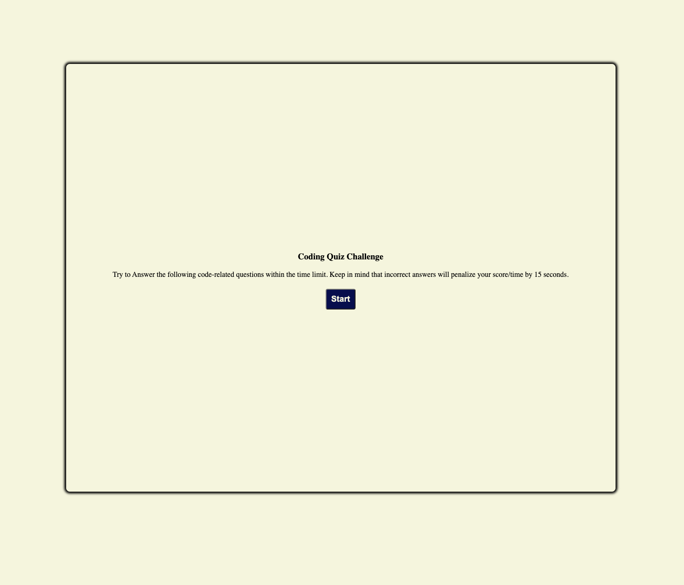
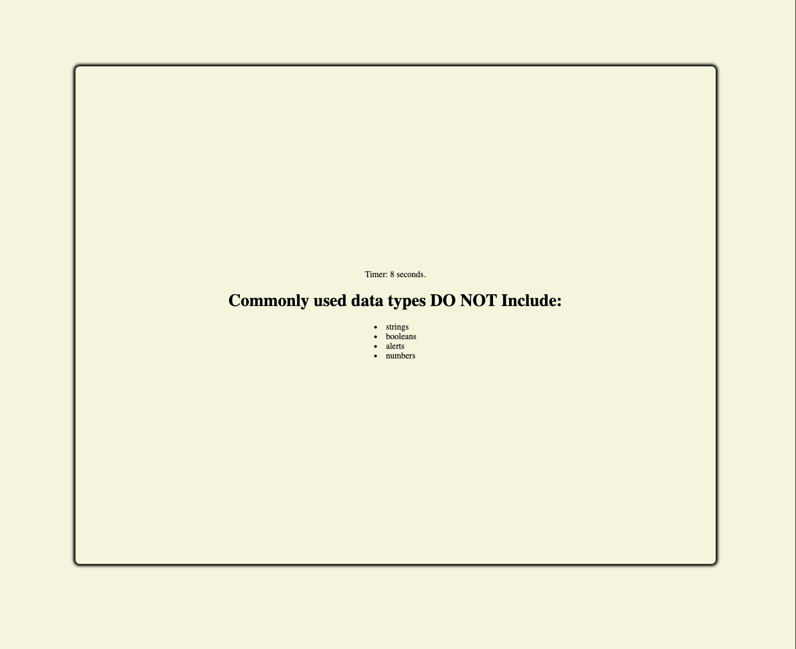
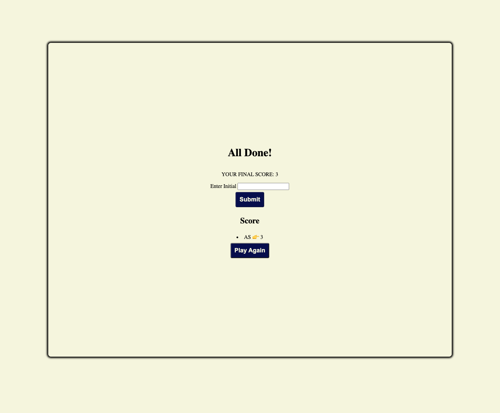

# Coding Quiz Challenge - JavaScript
## Description

This game application was built so that user can answer question related to JavaScript. It has a 15 seconds timer once the user start the game and every wrong answer will be penalized by 5 seconds. The game will end once the timer or the question has run out. 
Please visit the application here: [Coding Quiz Challenge](https://retnodamayanti.github.io/quiz_javascript/index.html)

## Installation

N/A

## Usage
- The screenshot below display the application landing page 

- The screenshot below shows the first question

- The screenshot below shows the result

 
## Credit
- Button and Body CSS: https://www.codingninjas.com/codestudio/library/how-to-create-a-quiz-app-using-javascript

## License

Please refer to the LICENSE in the repo.